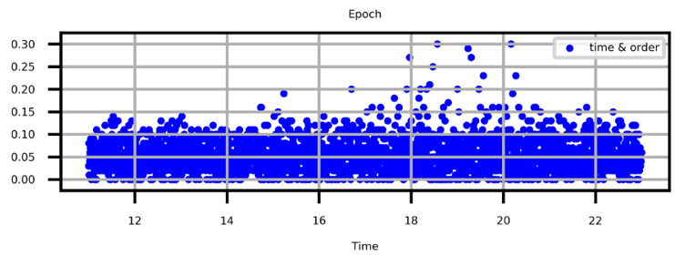
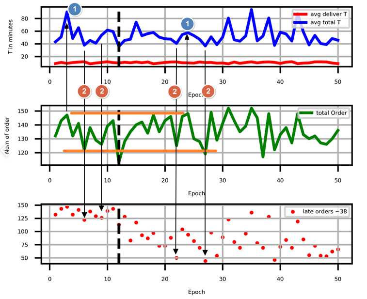

# KnowhowFactory

Tensorflow DQN for automating Chicken cooking process 
텐서플로우-DQN을 이용한 치킨 조리 자동화 프로세스 

 

조리 환경의 input을 받은 이후, **`특정 시점에서 최적화된 조리 순서를 결정해주는 동작을 수행`**

> 구동 환경:
>
> 1. Python 3.7
> 2. Tensorflow 1.15
> 3. Windows 10

**사용한 레임워크 & 라이브러리 :**

- Tensorflow
- Deep Q Learning (DQN) :
  > **두 부분의 Q 함수로 이루어진 loss function의 차를 줄여나가는 방식으로 동작**  
  >
  > 1. 현재 Q function과 target Q function의 업데이트 frequency를 차이를 두어, target이 흔들리는 정도를 낮춰, 전체 함수가 수렴할 수 있도록 함  
  > 2. 업데이트는 시간에 따른 Play 수에 맞추어 자동으로 업데이트 시켜야 하지만, 최고 score를 저장하기 위한 score 기록 부분을 따로 표시하여, 최고 Score 달성 시 업데이트 하도록 함 
  > 3. 매 episode 마다 최소 experience 만족 이후, 지정한 expereince 마다 Q1, Q2 loss를 줄인 후, Q1을 Q2로 덮어 씌우도록 하고, 이를 반복
  > 4. **`매장의 전체 process 주문 접수 ~ 배달 까지를 모두 수치화 하여 관리하는 것이 핵심`**

 

- Simulator :

  - 변수

    - 시간 흐름(현재 시간): 시간별로 주문이 흘러가고, 매장 직원들의 상태를 관리하도록 함
    - 나머지 초기 Setting 은 초기화 함수로 설정한 후, 매 Episode시 Random하게 변경될 수 있도록 하였음

  - 시간:

    - 전체 시뮬레이터 시간은 오전 09 ~ 오후 24시 까지로 설정하였음

  - 초기 Setting :

    1. Order 생성 함수
       - 주문:다음과 같이 2번의 점심, 저녁 peak time 을 모사하도록 디자인 하였음(12시, 19시)
         
    2. Worker 생성 함수 & Machine 생성 함수

       - 매장 정보: 교촌치킨 B ~ C형 매장을 기준으로 매장 직원 수, 배달부 수, 튀김기를 설정

    3. Logger  
       - 시간의 흐름에 따른, 순간의 매장 상태를 로그로 출력

---

 

## Table of Contents

<!-- https://github.com/didghwns0514/KnowhowFactory-Chicken-Automation -->
<!-- https://github.com/didghwns0514/KnowhowFactory-Chicken-Automation/blob/main/README.md -->

- Sections
  - [KnowhowFactory-Chicken-Automation](https://github.com/didghwns0514/KnowhowFactory-Chicken-Automation/blob/main/README.md#KnowhowFactory-Chicken-Automation)
  - [Usage](https://github.com/didghwns0514/KnowhowFactory-Chicken-Automation/blob/main/README.md#Usage)
  - [Maintainer](https://github.com/didghwns0514/KnowhowFactory-Chicken-Automation/blob/main/README.md#Maintainer)

 
 

## Sections

---

### KnowhowFactory-Chicken-Automation

**Status :** For training and Generating DQN in local PC with powerful GPU

**Used :**

- DQN

  - Bubble Sorting 대비, 60%의 지연 주문 감소
    > Note : 시장 조사 & 설문으로 부터의 결과 분석  
    >
    > - **`지연 주문 : 고객 주문 접수로 부터, 배달 도착까지 30분 이상 걸리는 시점 부터 '지연 주문'`**  
    > - 고객의 별점은 보통의 경우 지연 주문의 유무에서 갈린다.  
    >    맛이 좋을 수록 의외로 고객이 인내심을 가지고 기다리는 경우가 많고, 별점이 맛에 달려 있음  
    > - 결과적으로, **`대부분의 경우에 지연 주문을 줄여야 별점이 오름!`**

- Simulator
  - Time based status 관리
  - 초기 Setting 함수들 call 하여, 랜덤성이 있는 환경 부여

<bn>

- 결과
  

   

  > Note : 세부 내용은 documnet file 확인

  - 너무 많은 주문이 몰려, 튀김 Status에서 병목현상이 발생하여 물리적으로 개선할 수 없는 경우를 제외, Bubble Sorting 대비 60% 의 지연 주문 감소를 확인
  - **`DQN의 동작을 확인하였을 때, 지연주문이 확실한 경우, 그 주문을 뒤로 미루고 지연 주문으로 갈 수 있는 Order를 미리 처리 하도록 하여, 전체 지연 주문 발생을 줄이는 형식으로 동작하는 것을 확인`**

 

---

### Usage

**Simple usage :**

- agent. py 에서 Training을 하면 simulator가 back 단에서 돌아가도록 되어있음
- Simulator만 따로 돌릴시, simulator.py를 따로 사용하면 됨

---

### Maintainer

**People**: Yang HoJun(양호준)(didghwns0514@gmail.com)

**More Info:**

- Github link : [Link](https://github.com/didghwns0514/KnowhowFactory-Chicken-Automation)
- Personal Blog : [Link](https://korshika.tistory.com/)

**Suggestions:**

- Feel free to contact

---

## Definitions

_These definitions are provided to clarify any terms used above._

- **Documentation repositories**: Feel free to share. Thank you!
